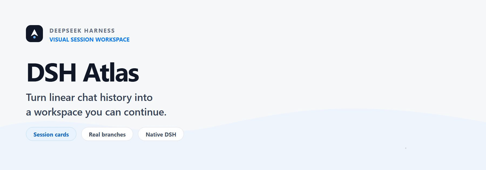
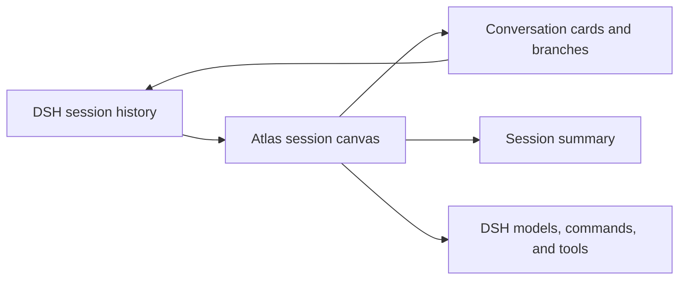

<p align="center">
  <picture>
    <source media="(prefers-reduced-motion: reduce)" srcset="./assets/readme/hero.en.svg">
    
  </picture>
</p>

<p align="center">
  <strong>English</strong> · <a href="./README.zh-CN.md">简体中文</a>
</p>

<p align="center">
  A visual session workspace for DeepSeek Harness Web.<br>
  Keep DSH models, commands, tools, and history while reorganizing long sessions into cards and real branches.
</p>

<p align="center">
  <a href="#live-demo">Live Demo</a> ·
  <a href="#quick-start">Quick Start</a> ·
  <a href="#core-capabilities">Core Capabilities</a> ·
  <a href="#development">Development</a> ·
  <a href="./docs/design/apple-interface-guidelines.md">Design Guidelines</a>
</p>

## Live Demo

<p align="center">
  
</p>

> A 34-second loop: switch from native DSH to Atlas → create a card and send a prompt → watch the model response → open full conversation details → continue from the current card → branch from an existing answer → select and send `/compact` from the Slash command menu → inspect the standalone command card → label cards as Important, Key Conclusion, or Needs Verification.
>
> Charts and visual artifacts in conversation details are generated by the optional **[dsh-artifact](https://github.com/sumarilkkxx/dsh-artifact)** plugin. Atlas mounts and displays those tool outputs in their original message order.

## What is DSH Atlas?

DeepSeek Harness executes the work. Atlas makes that work easier to understand, organize, and continue.

Atlas treats the **DSH Session Log as the single source of truth** and projects each turn—user message, model response, and tool activity—into a card. From the canvas, you can review context, arrange nodes, mark conclusions, create real session branches, and keep using every model, permission preset, Slash command, Skill, and file context already connected to DSH.

Atlas does not duplicate the chat system or rewrite original conversations. It is a visual working layer built on top of DSH.

## Quick Start

Install [Node.js](https://nodejs.org/) and pnpm, then install Atlas through the official DSH npm package and start DSH Web:

```powershell
npx @deepseek-ai/dsh plugin --profile web add github:sumarilkkxx/dsh-atlas
npx @deepseek-ai/dsh web
```

DSH Web opens at `http://127.0.0.1:3080` by default. Configure a model and choose a workspace in Settings, then click **Card View** in the top navigation. Atlas automatically resolves the active workspace and native session.

> Source development requires Node.js `>= 22.19.0` and pnpm. Full session, model, and command behavior must be verified inside a DSH Host.

## Core Capabilities

| Capability | How it works in Atlas |
| --- | --- |
| Independent session canvases | Every primary session owns its own canvas. Creating a conversation creates a new DSH history and canvas instead of inserting a card into the current one. |
| Cards and real branches | Each turn becomes a card. Branches created from any answer use native DSH Fork and preserve their context relationship. |
| Live execution status | Cards show preparation, reasoning, tool calls, and generation as they happen. Once complete, the persisted DSH history becomes authoritative, preventing stale “Thinking” states. |
| Tools and artifacts | Details preserve original tool-event order and embed ECharts / ECharts-GL, Mermaid, and sandboxed `render_html` canvases. New artifacts can appear incrementally while details remain open. |
| Native input capabilities | Atlas reads the complete DSH model directory and supports providers, reasoning levels, real permission presets, Slash commands, files, conversation history, and Skills. |
| Aggregated performance metrics | Every card shows LLM time, time to first token, token rate, cache hit rate, and input/output tokens without exposing individual model-call breakdowns. |
| Canvas controls | Drag cards, pan the canvas, zoom from 50% to 400%, auto-arrange nodes, locate the active node, and collapse downstream cards. |
| Information organization | Search sessions and cards, then scan long-running work using Important, Key Conclusion, and Needs Verification states. |

### A card is more than an answer summary

- Markdown content supports headings, paragraphs, lists, tables, quotes, links, and code blocks.
- Tool names and status text stay within card boundaries so long parameters cannot break the layout.
- Streaming text, tool results, and late-arriving images update from DSH history while the details view stays open.
- Card positions are stored in the local Atlas database; viewport, zoom, and collapse state stay in browser storage.
- Deleting a card affects only the Atlas canvas. The original DSH conversation is retained.

### Keep using DSH from the canvas

New-session and follow-up cards expose the same session-level capabilities as native DSH:

- Browse every model provider and model directory connected to DSH, and select models through the real session API.
- Use each model's reasoning levels and the Read Only, Workspace Write, or Full Access permission presets.
- Choose Slash commands from the menu or keyboard. Selecting a command only inserts it into the composer; DSH runs it after the user sends the message.
- Send a command on its own or with supporting text. Tool-only commands still produce traceable result cards.
- The `@` context menu is organized into local files, conversation history, and Skills. History cards support multi-select and inject real message content.
- Press `Enter` to send, `Shift + Enter` for a new line, and `Esc` or the empty canvas to close menus.

## How It Works



1. Atlas reads DSH session history for the current workspace and creates a stable card projection for every turn.
2. Streaming responses and tool events update only the card that initiated the request. Persisted session history then settles the final state.
3. Model selection, permissions, commands, prompts, and forks initiated from cards all run through the active DSH session API.
4. Atlas stores only auxiliary data such as layout, status, summaries, and indexes. DSH continues to own execution and original history.

## Local Files and Context

<details>
<summary><strong>Supported file types and parsing limits</strong></summary>

Attachments are parsed locally in the browser. Supported formats include:

- PDF files with a text layer; scanned PDFs require OCR first
- `.docx`; convert legacy `.doc` files before attaching
- `.xlsx`, `.xls`, and CSV
- Text, code, and configuration files, including Python, JavaScript/TypeScript, Java, Go, Rust, C/C++, C#, Shell, PowerShell, SQL, HTML/CSS, Vue, JSON, YAML, TOML, INI, Dockerfile, and Makefile

Limits: 12 MB per file and 24 MB in total per send. Atlas extracts up to 48,000 characters from each file and 96,000 characters in total. Extracted text is written into the DSH history as context for that turn; Atlas does not upload or retain the original binary files.

</details>

## Development

```powershell
git clone https://github.com/sumarilkkxx/dsh-atlas.git
cd dsh-atlas
pnpm install
pnpm build
```

Link the local directory to the DSH Web profile:

```powershell
dsh plugin --profile web add link:D:\path\to\dsh-atlas
dsh web
```

Local preview and checks:

```powershell
pnpm dev       # Vite UI preview, usually http://127.0.0.1:5173/
pnpm test      # Run the test suite
pnpm build     # Build installable frontend assets
pnpm preview   # Preview the production build
```

> Do not open `dist/index.html` directly. Atlas depends on same-origin APIs and DSH Host context, so production capabilities must load through HTTP / DSH Web Server.

### Project Structure

```text
dsh-atlas/
├─ client.js                     # DSH browser bridge and view switching
├─ index.js                      # Host plugin, static assets, and API mounts
├─ cordis.patch.yml              # DSH Web profile injection configuration
├─ src/
│  ├─ app.tsx                    # React session canvas and native composer
│  ├─ index.css                  # Theme, card, detail, and menu styles
│  ├─ lib/conversation-graph.js  # Session nodes and performance aggregation
│  └─ server/store.js            # SQLite session-event projection
├─ dist/                         # Installable production assets
├─ docs/design/                  # Interface design principles
└─ assets/readme/                # README visual assets
```

## Data and Security Boundaries

- The DSH Session Log remains the single source of truth for conversation history.
- The Atlas database lives at `$DSH_HOME/atlas/atlas.db` by default and stores display projections, branch relationships, card positions, and versioned summaries.
- Atlas never overwrites or deletes original DSH history. Delete operations only hide Atlas projections.
- Local files and conversation history enter a turn only after explicit user selection.
- Atlas refreshes the canvas summary asynchronously with the current model only when the session projection changes and the summary cache expires. Summaries are never written back to the Session Log.
- `render_html` uses a restricted iframe and Content Security Policy that blocks external networking, forms, objects, and top-level navigation.
- Atlas APIs accept only same-origin or trusted Host access by default. Additional Hosts must be added explicitly in plugin configuration.

## Tech Stack

React 19 · TypeScript · Vite 7 · Tailwind CSS 4 · Radix UI · React Markdown + GFM · SQLite (`node:sqlite`) · DeepSeek Harness / Cordis

## License

[MIT](./LICENSE)
