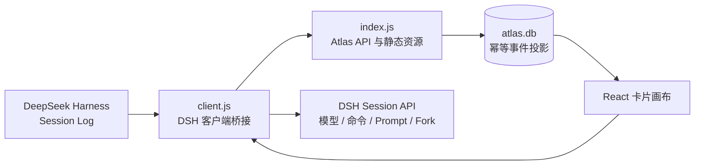

# DSH Atlas

> 把 DeepSeek Harness 的线性对话历史转换为可拖拽、可分支、可继续工作的可视化会话画布。

DSH Atlas 是面向 DeepSeek Harness Web 的对话管理插件。它以 DSH 原始 Session Log 为事实来源，将每次提问、回答、工具调用和真实分支投影为卡片与连线，让长会话不再只能从上到下滚动查找，同时保留原生模型选择、命令执行和继续对话能力。

## 为什么需要 Atlas

随着对话轮次增加，关键结论、替代方案、工具结果和分支上下文很容易淹没在线性消息流中。Atlas 提供另一种组织方式：

- 一个主会话对应一张独立画布。
- 一轮“用户问题 + DSH 回答”对应一张卡片。
- 原生会话分支对应画布中的真实分支节点。
- Atlas 负责整理和导航，DSH 仍负责模型、命令、工具与会话历史。

## 核心功能

### 会话画布

- 按 DSH 工作区整理会话，进入卡片视图时自动定位当前原生会话。
- 每个主会话使用独立画布，避免把所有历史对话平铺到同一空间。
- 支持整卡拖拽、画布平移、50%–400% 缩放、自动整理和当前节点定位。
- 使用平滑曲线连接上下文节点，并通过二级菜单快速定位真实会话分支。
- 卡片位置持久化到本地 Atlas 数据库；缩放、视口和折叠状态保存在浏览器本地。

### 卡片与详情

- 卡片展示 Markdown 摘要、工具调用数量、待办状态和实时回复。
- 详情支持标题、段落、列表、表格、引用、链接、行内代码和代码块等 Markdown 内容。
- 支持展开普通工具过程，并内嵌展示 `dsh-artifact` 产物：
  - ECharts / ECharts-GL
  - Mermaid
  - `render_html` 沙箱画布
- 支持从任意回答位置创建 DSH 原生分支。
- 支持从 Atlas 中隐藏/删除卡片；该操作不会删除 DSH 原始 Session Log。

### 内嵌原生对话框

卡片详情内提供与 DSH 原生输入区一致的会话级能力，无需返回线性对话页面：

- 直接读取 DSH 模型目录并切换当前会话的模型。
- 根据模型元数据选择推理等级。
- 输入 `/` 打开命令菜单，支持 `/status`、`/compact` 和 `/model`。
- 输入 `@` 打开引用与文件入口。
- 选择本地文本或代码文件作为本次消息上下文。
- `Enter` 发送，`Shift + Enter` 换行。
- 回复流式状态会同步回画布与详情。

> 文件附件当前面向文本和代码文件：单个文件最大 256 KB，单次合计最大 512 KB。文件内容只在用户发送时作为该轮消息上下文提交。

### 外观与可用性

- 支持独立的深色/浅色画布切换。
- 卡片、详情、Markdown、菜单与 Artifact 会跟随当前 Atlas 主题。
- 支持卡片搜索、分支折叠、响应式布局和键盘操作。

## 实现逻辑



项目由四个主要部分组成：

1. **DSH Bundle 接入**
   `cordis.patch.yml` 将 `dsh-atlas` 注入 Web profile，并复用 DSH 已有的 Web Server。

2. **Host 服务与投影**
   `index.js` 挂载 Atlas 前端资源和本地 API；`src/server/store.js` 将 DSH 持久事件幂等投影到 SQLite。冷启动重放不会重复生成卡片，分支关系、工具过程和卡片位置均使用稳定 Session/Event 标识。

3. **浏览器桥接**
   `client.js` 在 DSH 页面注册“对话 / 卡片视图”切换，并连接 `ctx.sessions`、`ctx.workspaces` 和会话级模型目录。模型选择、命令、Prompt、创建会话与 Fork 都调用 DSH 原生接口，不修改模型请求链路。

4. **React 画布**
   `src/app.tsx` 负责会话树、卡片布局、曲线连接、拖拽、详情、Markdown、Artifact 和内嵌输入框；生产构建输出到 `dist/`，由 Host 插件同源加载。

## 安装

### 环境要求

- 已安装并可以运行 DeepSeek Harness Web/Desktop。
- DSH 使用支持 Web profile 与社区插件的版本。
- 从源码开发时需要 Node.js `>= 22.19.0` 和 pnpm。

### 从 GitHub 安装（推荐）

```powershell
dsh plugin --profile web add github:sumarilkkxx/dsh-atlas
dsh web
```

打开 DSH Web 页面后，点击页面顶部的 **卡片视图** 即可进入 Atlas。

### 从本地目录安装

克隆并构建项目：

```powershell
git clone https://github.com/sumarilkkxx/dsh-atlas.git
cd dsh-atlas
pnpm install
pnpm build
```

将本地目录链接到 DSH Web profile：

```powershell
dsh plugin --profile web add link:D:\path\to\dsh-atlas
dsh web
```

### Desktop 内置 CLI

如果 DeepSeek Harness Desktop 没有把 `dsh` 加入 `PATH`，可以调用桌面应用内置 CLI。请将路径替换为实际安装位置：

```powershell
node "D:\DeepSeek Harness\resources\host\node_modules\@deepseek-ai\dsh\lib\bin.js" plugin --profile web add "github:sumarilkkxx/dsh-atlas"
node "D:\DeepSeek Harness\resources\host\node_modules\@deepseek-ai\dsh\lib\bin.js" web
```

## 使用方式

1. 在 DSH 中打开任意已有会话。
2. 点击顶部 **卡片视图**。
3. 在左侧选择工作区和主会话；展开箭头可以查看分支子菜单。
4. 拖动卡片调整布局，使用滚轮/缩放按钮控制视口。
5. 点击卡片或右下角箭头打开详情。
6. 在详情底部直接选择模型、推理等级、文件或命令并继续对话。
7. 点击 **返回对话** 可以随时切回 DSH 原生线性视图。

## 本地开发

```powershell
pnpm install
pnpm dev
```

访问 Vite 输出的本地地址（通常是 `http://127.0.0.1:5173/`）可以查看独立 UI 预览。完整的 DSH 会话、模型与命令能力必须在插件挂载到 DSH 后验证。

常用命令：

```powershell
pnpm build     # TypeScript 检查、Vite 构建及桥接脚本语法检查
pnpm preview   # 预览生产构建
pnpm test      # 构建并运行桥接、API、投影和分支逻辑测试
```

> 不要直接双击 `dist/index.html`。Atlas 依赖同源 API 与 DSH 宿主上下文，构建产物需要通过 HTTP/DSH Web Server 加载。

## 项目结构

```text
dsh-atlas/
├─ client.js                 # DSH 浏览器端桥接与视图切换
├─ index.js                  # Host 插件、静态资源与 API 挂载
├─ cordis.patch.yml          # DSH Web profile 注入配置
├─ src/
│  ├─ app.tsx                # React 会话画布与内嵌输入框
│  ├─ index.css              # 主题、画布、卡片和菜单样式
│  └─ server/store.js        # SQLite 会话事件投影
├─ dist/                     # 可安装的生产前端资源
└─ docs/design/              # UI 设计规范参考
```

## 数据与安全边界

- DSH Session Log 始终是会话历史的唯一事实来源。
- Atlas 数据库默认位于 `$DSH_HOME/atlas/atlas.db`，保存展示投影、分支关系和卡片位置。
- Atlas 不覆写或删除 DSH 原始历史；“删除卡片”只隐藏 Atlas 投影。
- 模型选择、推理等级、命令、Prompt 和 Fork 均通过 DSH 当前会话接口执行。
- `render_html` 使用受限 iframe 和 Content Security Policy，禁止外部网络、表单、对象和顶层导航。
- 默认仅允许同源/受信 Host 访问 Atlas API；额外 Host 可通过插件配置显式添加。

## 技术栈

- React 19 + TypeScript
- Vite 7
- Tailwind CSS 4
- Radix UI
- React Markdown + GFM
- SQLite（Node.js 内置 `node:sqlite`）
- DeepSeek Harness / Cordis 插件系统

## License

[MIT](./LICENSE)
