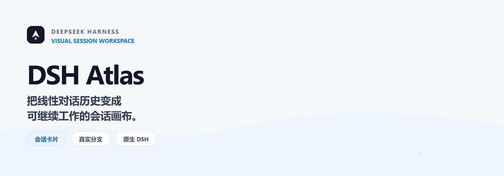
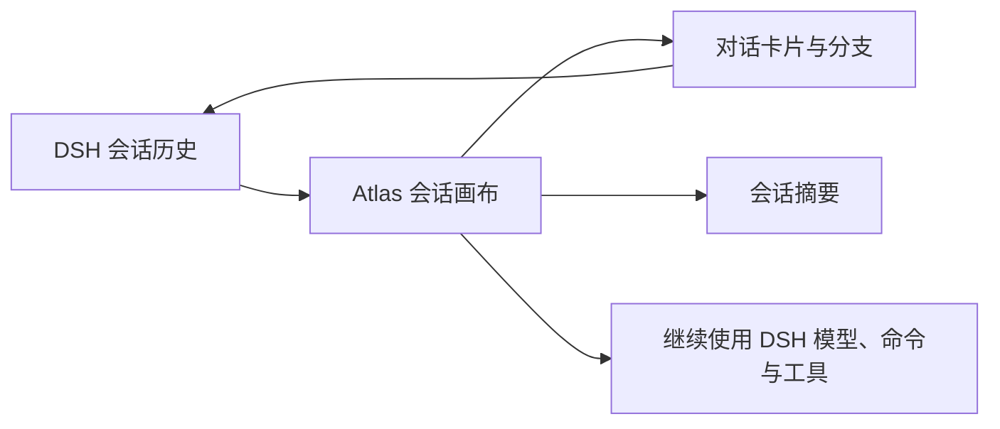

<p align="center">
  <picture>
    <source media="(prefers-reduced-motion: reduce)" srcset="./assets/readme/hero.svg">
    
  </picture>
</p>

<p align="center">
  面向 DeepSeek Harness Web 的可视化会话工作区<br>
  保留 DSH 原生模型、命令、工具和历史，用卡片与真实分支重新组织长会话。
</p>

<p align="center">
  <a href="#live-demo">Live Demo</a> ·
  <a href="#快速开始">快速开始</a> ·
  <a href="#核心能力">核心能力</a> ·
  <a href="#从源码开发">参与开发</a> ·
  <a href="./docs/design/apple-interface-guidelines.md">设计规范</a>
</p>

## Live Demo

<p align="center">
  
</p>

> 约 34 秒循环演示：从原生 DSH 切换到 Atlas → 新建卡片并发送问题 → 查看模型回复 → 打开完整对话详情 → 沿当前卡片继续下一轮提问 → 从已有回答创建分支并追问 → 打开 Slash 命令列表、选择并发送 `/compact`，查看生成的独立命令卡片 → 标记“重点 / 关键结论 / 待验证”等卡片状态。
>
> 对话详情中的图表与可视化内容由可选插件 **dsh-artifact** 生成；Atlas 负责按原始消息顺序挂载并展示对应工具产物。

## DSH Atlas 是什么

DeepSeek Harness 擅长执行任务，Atlas 负责让任务过程更容易理解和继续。

它以 **DSH Session Log 为唯一事实来源**，将一轮“用户消息 + 模型回答 + 工具活动”投影为一张卡片。你可以在画布中浏览上下文、整理节点、标记结论、创建真实会话分支，并继续使用 DSH 已接入的模型、权限、Slash 命令、Skills 与文件上下文。

Atlas 不复制一套聊天系统，也不会改写原始对话；它是 DSH 之上的可视化工作层。

## 快速开始

先安装 [Node.js](https://nodejs.org/) 与 pnpm，然后通过官方 npm 包安装 Atlas 插件并启动 DSH Web：

```powershell
npx @deepseek-ai/dsh plugin --profile web add github:sumarilkkxx/dsh-atlas
npx @deepseek-ai/dsh web
```

DSH Web 默认打开 `http://127.0.0.1:3080`。首次使用时在设置中配置模型并选择工作目录，然后点击页面顶部的 **卡片视图**；Atlas 会自动定位当前工作区与原生会话。

> 从源码开发需要 Node.js `>= 22.19.0` 与 pnpm；完整的会话、模型和命令能力必须在 DSH Host 中验证。

## 核心能力

| 能力 | Atlas 中的表现 |
| --- | --- |
| 独立会话画布 | 每个主会话拥有自己的画布；新建对话会创建新的会话历史与独立画布，而不是插入当前画布。 |
| 卡片与真实分支 | 每轮对话形成一张卡片；从任意回答创建的分支通过 DSH 原生 Fork 实现并保留上下文关系。 |
| 实时执行状态 | 卡片同步展示准备、思考、工具调用与生成状态；回复完成后以已落盘的 DSH 历史为准，不会停留在过期的“正在思考”。 |
| 工具与 Artifact | 详情按原始消息顺序展示工具活动，并内嵌 ECharts / ECharts-GL、Mermaid 与受限 `render_html` 画布；生成中的产物可增量加入已打开的详情。 |
| 原生输入能力 | 读取 DSH 完整模型目录，支持不同厂商模型、推理等级、真实权限范围、Slash 命令、文件、对话历史与 Skills。 |
| 聚合性能指标 | 每张卡片展示 LLM 用时、首 token、token 速率、缓存命中率以及输入/输出 token，不拆分单次模型调用。 |
| 画布操作 | 支持整卡拖拽、画布平移、50%–400% 缩放、自动整理、当前节点定位与后续节点折叠。 |
| 信息整理 | 搜索会话与卡片，并用“重点”“关键结论”“待验证”等语义状态快速扫描长任务。 |

### 一张卡片，不只是回答摘要

- Markdown 正文支持标题、段落、列表、表格、引用、链接与代码块。
- 工具状态与名称被限制在卡片内容区内，避免长参数破坏布局。
- 打开详情后，流式文本、工具结果和后生成图片会随 DSH 历史更新，无需关闭重开。
- 卡片位置保存在本地 Atlas 数据库；视口、缩放和折叠状态保存在浏览器本地。
- “删除卡片”只影响 Atlas 画布，DSH 原始对话会保留。

### 在画布里继续使用 DSH

新会话与追问卡片提供与原生 DSH 一致的会话级能力：

- 展示 DSH 当前接入的**全部模型厂商与模型目录**，并使用真实会话接口完成选择。
- 支持模型对应的推理等级，以及“只读 / 工作区写入 / 全部权限”三种真实权限范围。
- Slash 命令可通过菜单或键盘选择；选中只会写入输入框，用户发送后才交由 DSH 执行。
- 命令可以单独发送，也可以与补充文本一起发送；工具型命令同样会形成可追踪的卡片结果。
- `@` 上下文入口收敛为本地文件、对话历史与 Skills；历史卡片支持多选并注入真实消息内容。
- `Enter` 发送，`Shift + Enter` 换行；菜单支持 `Esc` 或点击空白处关闭。

## 工作方式



1. Atlas 读取当前工作区的 DSH 会话历史，并按轮次生成稳定的卡片投影。
2. 流式回复与工具事件只更新发起本轮请求的卡片；会话落盘后再用最终历史收敛显示状态。
3. 从卡片发起的模型选择、权限、命令、Prompt 与 Fork 均通过 DSH 当前会话接口执行。
4. Atlas 只保存布局、状态、摘要与索引等辅助数据，DSH 继续管理原始历史和执行能力。

## 本地文件与上下文

<details>
<summary><strong>支持的文件类型与解析限制</strong></summary>

附件在浏览器本地解析，支持：

- PDF（需要文本层；扫描版需先 OCR）
- `.docx`（旧版 `.doc` 请先转换）
- `.xlsx` / `.xls` / CSV
- 文本、代码与配置文件，包括 Python、JavaScript/TypeScript、Java、Go、Rust、C/C++、C#、Shell、PowerShell、SQL、HTML/CSS、Vue、JSON、YAML、TOML、INI、Dockerfile 与 Makefile

限制：单个文件最大 12 MB，单次合计最大 24 MB；每个文件最多提取 48,000 个字符，单次最多 96,000 个字符。提取正文会作为该轮消息上下文写入 DSH 历史，原始二进制文件不会上传或保存到 Atlas。

</details>

## 从源码开发

```powershell
git clone https://github.com/sumarilkkxx/dsh-atlas.git
cd dsh-atlas
pnpm install
pnpm build
```

将本地目录链接到 DSH Web profile：

```powershell
dsh plugin --profile web add link:D:\path\to\dsh-atlas
dsh web
```

独立预览与检查：

```powershell
pnpm dev       # Vite UI 预览，通常为 http://127.0.0.1:5173/
pnpm test      # 运行测试
pnpm build     # 构建可安装的前端资源
pnpm preview   # 预览生产构建
```

> 不要直接双击 `dist/index.html`。Atlas 依赖同源 API 与 DSH 宿主上下文，生产能力需要通过 HTTP / DSH Web Server 加载。

### 项目结构

```text
dsh-atlas/
├─ client.js                     # DSH 浏览器端桥接与视图切换
├─ index.js                      # Host 插件、静态资源与 API 挂载
├─ cordis.patch.yml              # DSH Web profile 注入配置
├─ src/
│  ├─ app.tsx                    # React 会话画布与原生输入区
│  ├─ index.css                  # 主题、卡片、详情与菜单样式
│  ├─ lib/conversation-graph.js  # 会话节点与性能指标聚合
│  └─ server/store.js            # SQLite 会话事件投影
├─ dist/                         # 可安装的生产资源
├─ docs/design/                  # 界面设计原则
└─ assets/readme/                # README 视觉素材
```

## 数据与安全边界

- DSH Session Log 始终是会话历史的唯一事实来源。
- Atlas 数据库默认位于 `$DSH_HOME/atlas/atlas.db`，保存展示投影、分支关系、卡片位置与版本化摘要。
- Atlas 不覆写或删除 DSH 原始历史；删除操作只隐藏 Atlas 投影。
- 本地文件与对话历史仅在用户明确选择后加入当轮上下文。
- 仅在会话投影变化且摘要缓存过期时，Atlas 才使用当前模型异步更新画布摘要；摘要不会写回 Session Log。
- `render_html` 使用受限 iframe 与 Content Security Policy，禁止外部网络、表单、对象和顶层导航。
- 默认仅允许同源或受信 Host 访问 Atlas API；额外 Host 需要在插件配置中显式添加。

## 技术栈

React 19 · TypeScript · Vite 7 · Tailwind CSS 4 · Radix UI · React Markdown + GFM · SQLite (`node:sqlite`) · DeepSeek Harness / Cordis

## License

[MIT](./LICENSE)
